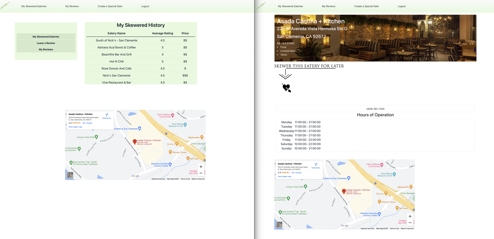
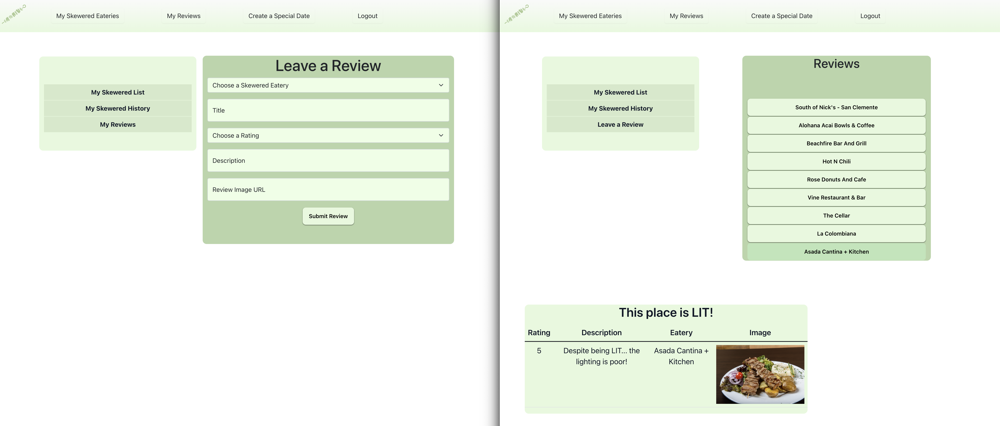
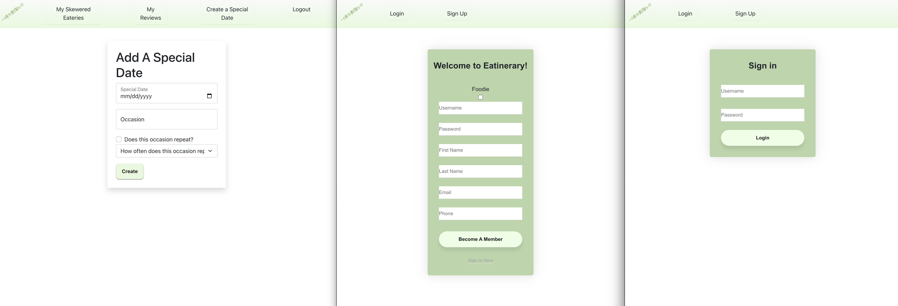

# App name: Restaurant Repo

## Design

* [API design](docs/apis.md)
* [Data model](docs/data-model.md)
* [GHI](docs/ghi.md)
* [Integrations](docs/integrations.md)

## Team name: The Cuisine Coders

## List of team members:
* Ariana Kim
* Cameron Guadagnino
* Brandon Dix
* David Quinlan

## Requirements:
* Need your own YELP API key
* Remove ad blocker for better compatibility with homepage

## Summary:
* Detailed collection of eateries that have garnered interest
* Tagline: "Fastest way to access all eateries you may have missed"

## Intended Market:
The people that we expect to use this are:
* "Foodies" that range from 16yrs+, who are interested in being reminded in eateries they’re interested in.
* Eatery owners who are interested in gaining exposure and advertising their eatery business advertising.

## Ubiquitous language (work in progress):
* "Foodie": Individual user/consumer of the app that is interested in being reminded in eateries they're interested in.
* Eatery owner: Owner of an eatery that has an account/profile - manages an eatery or many eateries
* Eatery: a single eatery location/business
* "Skewer": The action of a Foodie saving/pinning/favorite-ing an eatery to their list of saved/"skewered" eateries
* "Special Date": A date that a Foodie can save and remind themselves of later

## Current Functionality:
* Create account/profile
    * "Foodies" can create a foodie account/profile
* Login/Logout
    * Users ("Foodies" and eatery owners) can login/logout of account/profile
    * User data is only visible to that specific user during their logged in session
* Search feature for the eateries
    * create filter system
        * Filter criteria: cuisine and location, or location by itself
* Home Page:
    * Initially loads the home page with local eateries based on the user's location
* Link Yelp API
    * Eateries data obtained form the Yelp API is stored in our local database, so if the Yelp API is down, access to pre-saved eateries is still available
    * list of eateries, reviews, hours of operation, photos
    * Get ratings
* Link Google Maps or other mapping API
    * Embed map into app
    * App should show a view of a map where it shows a "pin" of the skewered location
    * Traffic patterns & ETA from foodie's current location to skewered location
* Foodies Functionality
    * Save eateries for later by "skewering" them to your "skewered list"
    * Move eateries from your skewered list to the "skewered history list"
    * Click on the eatery entry in either the skewered list or skewered history list to get directions and additional details
    * When you click on "I've been here" in the skewered list it will remove it from your skewered list and put it into skewered history to show you have visited the eatery 
    * Leave a review including an image for an eatery that you have skewered
    * Add a special date to your skewered page to remind of an upcoming occasion as you look for a place to eat.
* Mobile responsive

## Future Development:
* Email functionality
    * Send email notification to food when an eatery is skewered
        * Email to include links to make reservations (online reservation site, phone number)
    * (STRETCH GOAL) Send email notification to eatery owner when an ad_slot is booked/reserved.
* Link Calendar (Google calendar API?)
    * There will be a calendar per city/zip (TBD by CuisineCoders) that keeps track of advertisement slots.
        * Eatery owners can pay for advertisement slots to have their eatery show up higher on searches during specific times. For example, an eatery owner can pay $x (TBD on how the price will be set) for the 6-7pm slot on specific dates, so their eatery will show up toward the top of the page when a foodie searches for eateries in that city/zip (TBD by CuisineCoders) during 6-7pm on the specific dates the eatery owner paid for.
    * Each foodie can choose to have their own calendar to save special days (birthdays, anniversaries, holidays, etc). The app will suggest eateries from the list of eateries that the foodie has “skewered”.
* Chat feature via websockets
    * Foodie can contact hostess of eatery and let them know they’re running late, on their way, etc. for reservation
* Payment system (Stripe API?)
    * Integrate some sort of payment system on the app so eatery owner can independently click, choose and pay for ad slots (refer to second bullet point in "Link Calendar" section above). This is a way for the eatery owners to increase exposure and traffic flow to eatery
* Light/Dark mode
* Owners microservice
    * Eatery owners can create an eatery owner account/profile
    * payment service for ad slots
    * management tools for creating and updating their Eatery
