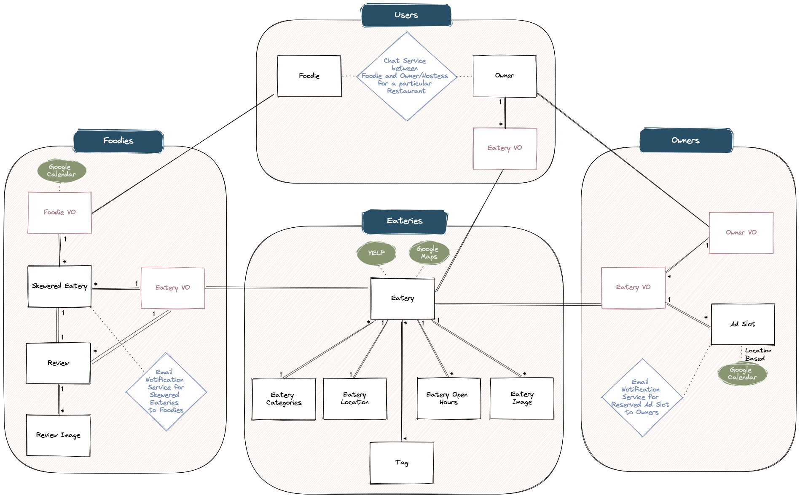

# Data models

## User (Custom User model based on Django's built-in user model?) ???
| Name            | Type    | Unique | Optional |
|-----------------|---------|--------|----------|
| ???             | ???     | ???    | ???      |

## Foodie
| Name            | Type    | Unique | Optional |
|-----------------|---------|--------|----------|
| username        | str     | yes    | no       |
| first_name      | str     | no     | no       |
| last_name       | str     | no     | no       |
| email           | str     | yes    | no       |
| phone           | int     | yes    | no       |
| google_calendar | url?    | yes    | no       |

## Eatery_owner
| Name            | Type    | Unique | Optional |
|-----------------|---------|--------|----------|
| username        | str     | yes    | no       |
| first_name      | str     | no     | no       |
| last_name       | str     | no     | no       |
| email           | str     | yes    | no       |
| phone           | int     | yes    | no       |
| google_calendar | url?    | yes    | no       |
| eatery          | For.Key | yes    | no       |

## Eatery
| Name            | Type    | Unique | Optional |
|-----------------|---------|--------|----------|
| owner           | For.Key | no     | no       |
| eatery_name     | str     | no     | no       |
| email           | str     | yes    | yes      |
| phone           | str     | no (some owners may use same cell num for multiple eateries they own?)     | yes      |
| location        | OneToOne| no     | no       |
| website         | url     | no (multiple locations may have same website)    | yes      |
| yelp_id         | str     | yes    | yes      |
| href            | url     | no     | yes      |
| review_count    | int     | yes    | yes      |
| average_rating  | int     | yes    | yes      |
| price           | str     | yes    | yes      |
| tag             |Many2Many| no     | no       |
| categories      |Many2Many| yes    | yes      |

## Eatery_Image (one-to-many relationship between Eatery and EateryImage) (do we need this model to be separate from Image VO model OR can the Image VO model be used for both having Foreign keys in the Review AND Eatery models) ???
| Name            | Type    | Unique | Optional |
|-----------------|---------|--------|----------|
| eatery          | For.Key | no     | no       |
| image_url       | media/url? should we require image_url, or allow Foodie to upload image directly? (Need to look into this, and implications of user experience vs resources taken up for loading app when existing number of images in app increase dramatically)     | yes    | no       |

## Eatery_categories???
https://www.yelp.com/developers/documentation/v3/get_started

| Name            | Type    | Unique | Optional |
|-----------------|---------|--------|----------|
| alias           | str     | no     | no       |
| title           | str     | no     | no       |

## Eatery_location (??? - updates based on Curtis' feedback? Not sure how to update)
| Name            | Type    | Unique | Optional |
|-----------------|---------|--------|----------|
| address1        | str     | no     | no       |
| address2        | str     | no     | yes      |
| address3        | str     | no     | yes      |
| city            | str     | no     | no       |
| state           | str     | no     | no       |
| zip             | str     | no     | no       |
| country         | str     | no     | no       |

## Eatery_open_hours (one-to-many relationship between Eatery and Eatery_open_hours)
| Name            | Type    | Unique | Optional |
|-----------------|---------|--------|----------|
| id              | int     | yes    | no       |
| start           | str?int?| no     | no       |
| end             | str?int?| no     | no       |
| day (mon-fri)   | int(0-7)| no     | no       |

## Skewered_eatery
| Name            | Type    | Unique | Optional |
|-----------------|---------|--------|----------|
| eatery          | For.Key | no     | no       |
| foodie          | For.Key | no     | yes      |
| created_DateTime| date    | no     | no       |
| updated_DateTime| date    | no     | no       |
| has_visited     | bool    | no     | no       |
| is_active       | bool    | no     | no       |
| notes           | str/ textfield   | no     | no       |

## Tag (many-to-many relationship between Tag and Eatery. #datenight #brunch, etc. Tags are created by foodies and are visible and searchable by the entire app user-base, so any user can search for #datenight #brospot.
* //Discussed// Discuss with Cuisine Coders whether we want the tags to be related to Eateries instead of Skewered Eateries, and for the tags to be visible by everyone instead of just by the foodie that created them. That way the whole RestaurantRepo community can benefit from the tags other people add to Eateries, and can even search/filter by those tags.)

| Name            | Type    | Unique | Optional |
|-----------------|---------|--------|----------|
| tag             | str     | yes    | no       |

## Review
| Name            | Type    | Unique | Optional |
|-----------------|---------|--------|----------|
| title           | str     | no     | no       |
| rating          | int     | no     | no       |
| created_DateTime| date    | no     | no       |
| description     | str     | no     | no       |
| skewered_restaur| OneToOne| no     | no       |
| image           | For.Key | no     | yes      |

## Review_Image (one-to-many relationship between review and image)
| Name            | Type    | Unique | Optional |
|-----------------|---------|--------|----------|
| review          | For.Key | no     | yes      |
| image_url       | media/url? should we require picture_url, or allow Foodie to upload image directly? (Need to look into this, and implications of user experience vs resources taken up for loading app when existing number of images in app increase dramatically)     | yes    | no       |

## Ad_slot (for each continuous time slot)
| Name            | Type    | Unique | Optional |
|-----------------|---------|--------|----------|
| eatery          | For.Key | no     | no       |
| startdatetime   | DateTime| no     | no       |
| enddatetime     | DateTime| no     | no       |

## Payment
- We believe we should not need a payment model to even temporarily store payment information
- This will depend on what Stripe API requires - ideally we don't want to handle payment info directly for security/liability reasons (and let alone storing it)

