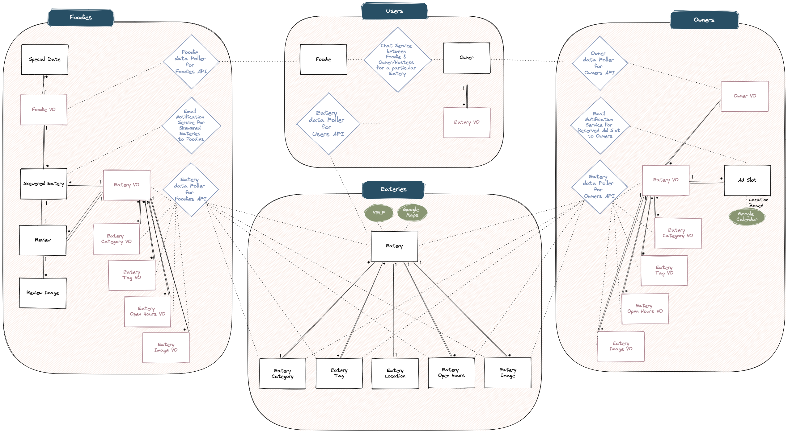

# Data models

## Users Microservice

### User (Custom User model based on Django's built-in AbstractUser model)
| Name            | Type    | Unique | Optional |
|-----------------|---------|--------|----------|
| phone           | str     | yes    | no       |
| google_calendar | url     | yes    | no       |

### Foodie
| Name            | Type    | Unique | Optional |
|-----------------|---------|--------|----------|
| user            | OneToOne (to User)| yes    | no       |

### Owner
| Name            | Type    | Unique | Optional |
|-----------------|---------|--------|----------|
| user            | OneToOne (to User)| yes    | no       |

### EateryVO
| Name            | Type    | Unique | Optional |
|-----------------|---------|--------|----------|
| import_href     | str     | yes    | no       |
| owner           | For.Key (to Owner)     | no    | no       |

## Eateries Microservice

### Eatery
| Name            | Type    | Unique | Optional |
|-----------------|---------|--------|----------|
| eatery_name     | str     | no     | no       |
| email           | str     | no     | no       |
| phone           | str     | no (some owners may use same cell num for multiple eateries they own)     | yes      |
| location        | OneToOne| no     | no       |
| website         | url     | no (multiple locations may have same website)    | no       |
| yelp_id         | str     | yes    | yes      |
| review_count    | int     | no     | no       |
| average_rating  | float   | no     | no       |
| price           | str     | no     | yes      |
| tags            |Many2Many| no     | yes      |
| categories      |Many2Many| no     | yes      |
| from_yelp       | bool    | no     | no       |
| latitude        | float   | no     | no       |
| longitude       | float   | no     | no       |

### YelpCategorySearchTerm
| Name            | Type    | Unique | Optional |
|-----------------|---------|--------|----------|
| category_term   | str     | yes    | no       |

### YelpLocationSearchTerm
| Name            | Type    | Unique | Optional |
|-----------------|---------|--------|----------|
| location_term   | str     | yes    | no       |

### YelpResult
| Name            | Type    | Unique | Optional |
|-----------------|---------|--------|----------|
| category_term   | For.Key (to YelpCategorySearchTerm)| no    | no       |
| location_term   | For.Key (to YelpLocationSearchTerm)| no    | no       |
| eatery          | For.Key (to Eatery)| no    | no       |

### EateryTag
| Name            | Type    | Unique | Optional |
|-----------------|---------|--------|----------|
| tag_name        | str     | yes    | no       |

### EateryCategory
https://www.yelp.com/developers/documentation/v3/get_started
| Name            | Type    | Unique | Optional |
|-----------------|---------|--------|----------|
| alias           | str     | yes    | no       |
| title           | str     | no     | no       |

### EateryLocation
| Name            | Type    | Unique | Optional |
|-----------------|---------|--------|----------|
| address1        | str     | no     | no       |
| address2        | str     | no     | yes      |
| address3        | str     | no     | yes      |
| city            | str     | no     | no       |
| state           | str     | no     | no       |
| zip_code        | str     | no     | no       |
| country         | str     | no     | no       |

### EateryOpenHours (one-to-many relationship between Eatery and EateryOpenHours)
| Name            | Type    | Unique | Optional |
|-----------------|---------|--------|----------|
| eatery          | For.Key (to Eatery)| no    | no       |
| weekday         | int     | no     | no       |
| start_time      | time    | no     | no       |
| end_time        | time    | no     | no       |

### EateryImage (one-to-many relationship between Eatery and EateryImage)
| Name            | Type    | Unique | Optional |
|-----------------|---------|--------|----------|
| image_url       | str     | no     | no       |
| eatery          | For.Key | no     | no       |

## Foodies Microservice

### EateryVO
| Name            | Type    | Unique | Optional |
|-----------------|---------|--------|----------|
| import_href     | str     | no     | no       |
| eatery_name     | str     | no     | no       |
| email           | str     | no     | yes      |
| phone           | str     | no (some owners may use same cell num for multiple eateries they own)     | yes      |
| website         | url     | no (multiple locations may have same website)    | no       |
| yelp_id         | str     | yes    | yes      |
| review_count    | int     | no     | no       |
| average_rating  | float   | no     | no       |
| price           | str     | no     | yes      |
| from_yelp       | bool    | no     | no       |
| location_address1| str    | no     | yes      |
| location_address2| str    | no     | yes      |
| location_address3| str    | no     | yes      |
| location_city    | str    | no     | yes      |
| location_state   | str    | no     | yes      |
| location_zip     | str    | no     | yes      |
| location_country | str    | no     | yes      |
| latitude        | float   | no     | yes      |
| longitude       | float   | no     | yes      |

### EateryCategory
https://www.yelp.com/developers/documentation/v3/get_started
| Name            | Type    | Unique | Optional |
|-----------------|---------|--------|----------|
| import_href     | str     | no     | no       |
| alias           | str     | yes    | no       |
| title           | str     | no     | no       |
| eatery_vo       |Many2Many (with EateryVO) | no     | no       |

### EateryTag
| Name            | Type    | Unique | Optional |
|-----------------|---------|--------|----------|
| import_href     | str     | no     | no       |
| tag_name        | str     | yes    | no       |
| eatery_vo       |Many2Many (with EateryVO) | no     | no       |

### EateryImageVO (one-to-many relationship between Eatery and EateryImage)
| Name            | Type    | Unique | Optional |
|-----------------|---------|--------|----------|
| import_href     | str     | no     | no       |
| image_url       | str     | no     | no       |
| eatery_vo       |Many2Many (with EateryVO) | no     | no       |

### EateryOpenHours (one-to-many relationship between Eatery and EateryOpenHours)
| Name            | Type    | Unique | Optional |
|-----------------|---------|--------|----------|
| import_href     | str     | no     | no       |
| weekday         | int     | no     | no       |
| start_time      | time    | no     | no       |
| end_time        | time    | no     | no       |
| eatery_vo       |For.Key (to EateryVO) | no     | no       |

### FoodieVO
| Name            | Type    | Unique | Optional |
|-----------------|---------|--------|----------|
| import_href     | str     | no     | no       |
| username        | str     | yes    | no       |
| first_name      | str     | no     | no       |
| last_name       | str     | no     | no       |
| email           | str     | yes    | no       |
| phone           | int     | yes    | no       |

### Skewered_eatery
| Name            | Type    | Unique | Optional |
|-----------------|---------|--------|----------|
| eatery_vo       | For.Key | no     | no       |
| foodie_vo       | For.Key | no     | yes      |
| created_DateTime| date    | no     | no       |
| updated_DateTime| date    | no     | no       |
| has_visited     | bool    | no     | no       |
| is_active       | bool    | no     | no       |
| notes           | str     | no     | no       |

### Review
| Name            | Type    | Unique | Optional |
|-----------------|---------|--------|----------|
| title           | str     | no     | no       |
| rating          | int     | no     | no       |
| created_DateTime| date    | no     | no       |
| description     | str     | no     | no       |
| eatery_vo       | For.Key | no     | no       |
| skewered_eatery | OneToOne| no     | no       |

### Review_Image (one-to-many relationship between review and image)
| Name            | Type    | Unique | Optional |
|-----------------|---------|--------|----------|
| image_url       | str     | yes    | no       |
| review          | For.Key | no     | yes      |

### SpecialDate (one-to-many relationship between foodie and specialdate)
| Name            | Type    | Unique | Optional |
|-----------------|---------|--------|----------|
| special_date    | date    | no     | no       |
| occasion        | str     | no     | yes      |
| has_passed      | bool    | no     | no       |
| repeats         | bool    | no     | no       |
| frequency       | str     | no     | yes      |
| foodie          | For.Key | no     | no       |

## Owners Microservice

### Eatery_owner
| Name            | Type    | Unique | Optional |
|-----------------|---------|--------|----------|
| username        | str     | yes    | no       |
| first_name      | str     | no     | no       |
| last_name       | str     | no     | no       |
| email           | str     | yes    | no       |
| phone           | int     | yes    | no       |
| google_calendar | url?    | yes    | no       |
| eatery          | For.Key | yes    | no       |

## Ad_slot (for each continuous time slot)
| Name            | Type    | Unique | Optional |
|-----------------|---------|--------|----------|
| eatery          | For.Key | no     | no       |
| startdatetime   | DateTime| no     | no       |
| enddatetime     | DateTime| no     | no       |
