# Graphical Human Interface

## Home page before Login
- Page visibility: All (Non-logged in, and Logged in users)
- Description: This is the main page that people will see when they get to the Web site.

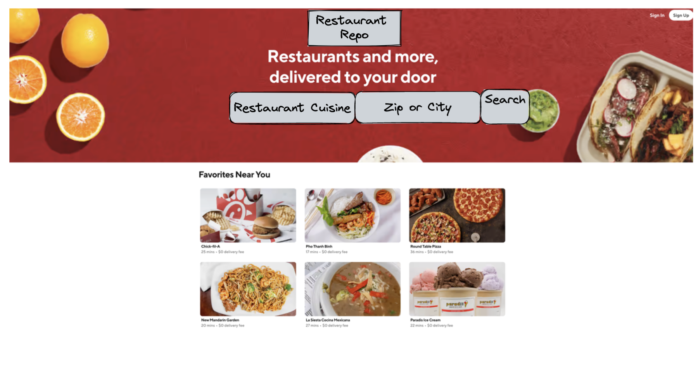

## Login page
- Page visibility: All (Non-logged in, and Logged in users)
- Description: There will be 2 separate log-in pages based on user type:
  1. Foodie Login page
  2. Restaurant Owner Login page

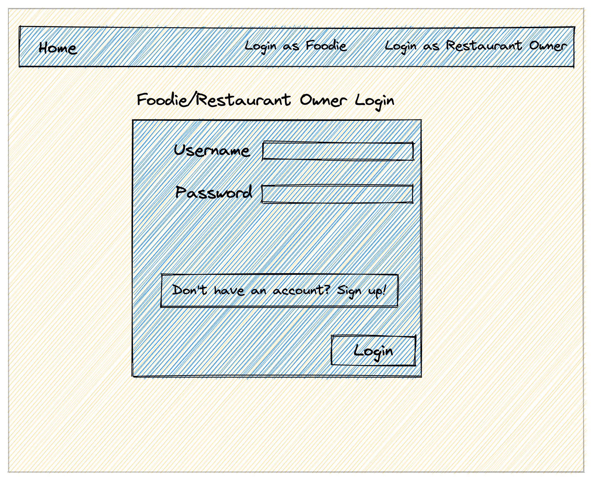

## Sign Up page
- Page visibility: All (Non-logged in, and Logged in users)
- Description: There will be 2 separate log-in pages based on user type:
  1. Foodie sign-up page
  2. Restaurant Owner sign-up page

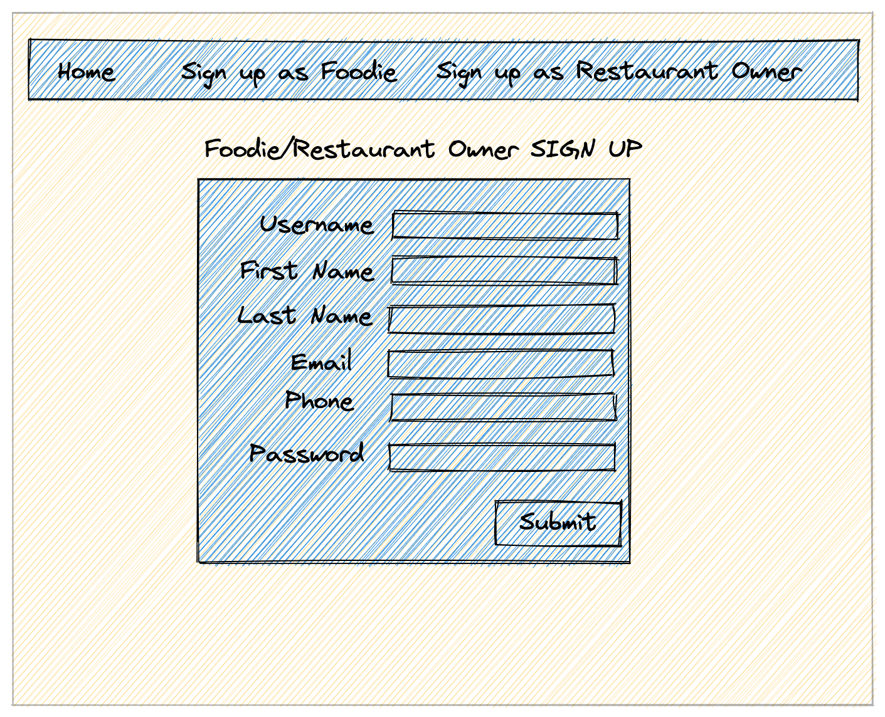

## Restaurants List/Search page
- Page visibility: All (Non-logged in, and Logged in users)
- Description:
    - The top has a search bar can filter restaurants by name/cuisine, and location (zip/city)
    - The lower left pane shows a list of restaurants matching the search parameters, with the restaurants with paid promotions for the current time slot showing up at the top.
    - The right pane shows the map view with pins of filtered restaurants showing up on the lower left pane. ("Owners who have paid for promotion" should read "Restaurants who have paid for promotion" -- and is ONLY a placeholder indicating that restaurants with paid promotion slots will show up at the top)

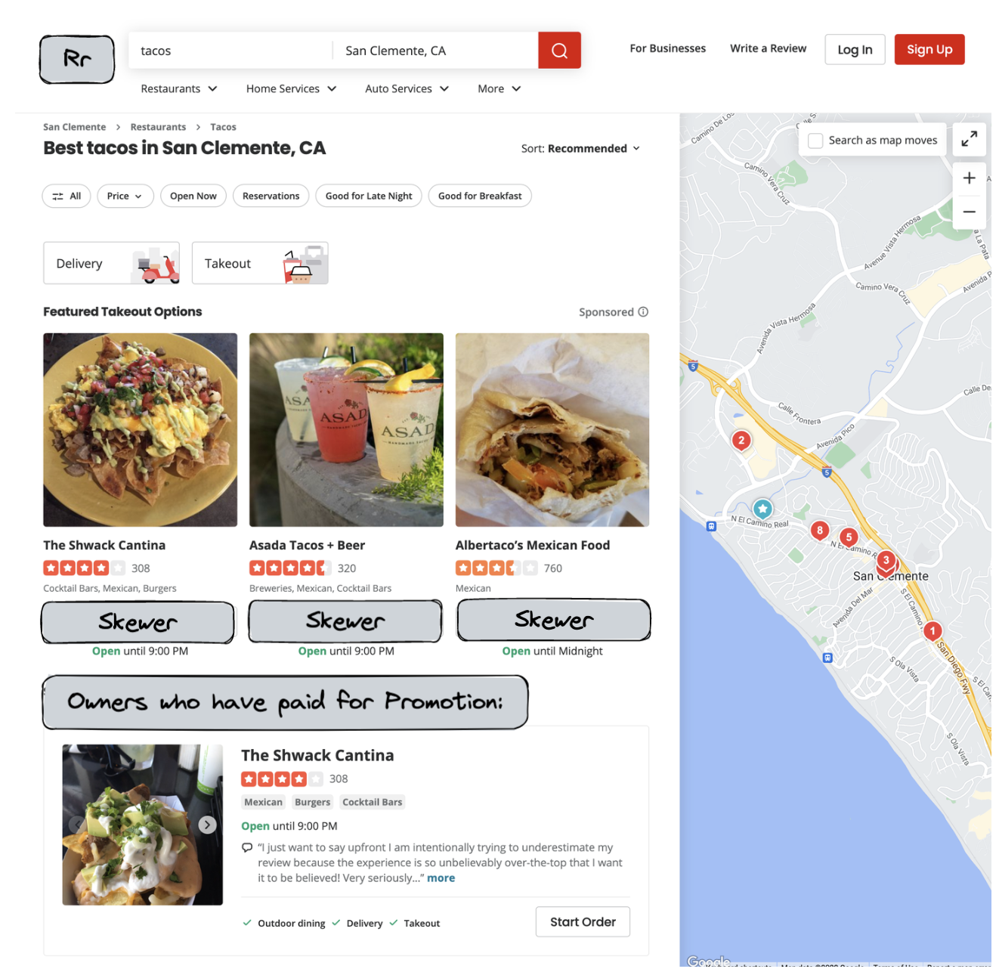

## Restaurants List/Search page
- Page visibility: Users (Both Foodies and Restaurant Owners, but page catered to Foodies)
- Description (same as previous image):
    - The top has a search bar can filter restaurants by name/cuisine, and location (zip/city)
    - The lower left pane shows a list of restaurants matching the search parameters, with the restaurants with paid promotions for the current time slot showing up at the top.
    - The lower right pane shows the map view with pins of filtered restaurants showing up on the lower left pane.

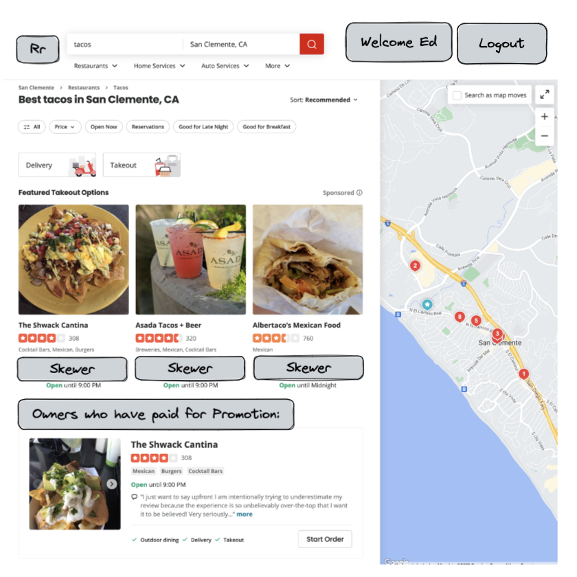

## Restaurant Detail page
- Page visibility: All (Non-logged in users as well as logged in users: Both Foodies and Restaurant Owners, but page catered to Foodies)
- Description:
    - This is the page showing the details for a single restaurant.
    - Any of the below buttons will prompt the user to log in:
        - "Add a photo" / "Write a review"
            - Once user is successfully logged in (assuming Foodie):
                - if the restaurant from which Foodie was prompted to log in by clicking on "Add a photo" is 1) already in the "MySkewered List" page, and 2) Foodie has visited this restaurant since skewering it ("has_visited" flag), then Foodie will be taken to the Foodie's "Create Review" page to submit a review + photos.
                - Else, if the restaurant from which Food was prompted to log in by clicking on "Add a photo" is already in the "MySkewered List" page, but Foodie has NOT YET visited this restaurant since skewering it ("has_visited" flag), then Foodie will be taken to the Foodie's "Create Review" page to submit a review + photos, but first asking/confirming with a pop-up message "Have you visited this restaurant since skewering it?"
                    - If "yes", Foodie will be taken to the Foodie's "Create Review" page to submit a review + photos
                    - If "not", Foodie will be faced with a pop-up message "Please visit the restaurant in order to add a photo and leave a review!"
                - Lastly, if the restaurant from which Foodie was prompted to log in by clicking on "Add a photo" is NOT already in the "MySkewered List" page, add the restaurant to the Foodie's "MySkewered" list, and notify the Foodie with pop-up message
                    - "*Restaurant Name* has been added to MySkewered!
                        - Go to MySkewered List page(*link to MySkewered*)
                        - I've already visited this restaurant! Take me to leave a review/add photos (*link to "Create Review" page*)
        - "Skewer"
            - Once user is successfully logged in (assuming Foodie), the restaurant from which Foodie was prompted to log in by clicking on "Skewer" will be skewered. The redirect page is the Foodie's "My SkeweredList" page.
        - "Make a Reservation"
            - Once user is successfully logged in (assuming Foodie), the restaurant from which Foodie was prompted to log in by clicking on "Make a Reservation" will be 1) Skewered, and 2) have a confirmed reservation. The redirect page is the Foodie's "MySkeweredList" page.

## Foodie - MySkewered List
- Page visibility: Foodies
- Description:
    - (NOT IN DRAWING:) Top/right area of the page will show a search bar to filter the skewered restaurants list by either cuisine, location, or reservation availability for date/time
    - Middle left pane is an extension of the NavBar, inside the "My Skewered" page.
    - Middle right pane is the list of all the restaurants this Foodie has skewered but not yet visited.
    - When a restaurant from the MySkeweredList is selected,
        - the bottom left pane is a map view showing the location of the restaurant (Either just location of restaurant, or distance from Foodie's current location to restaurant -- TBD)
        - the bottom right pane is a calendar view showing the reservation availability (This may not be an actual calendar as GHI, it may be a list of reservation slots that are available at the time -- TBD)

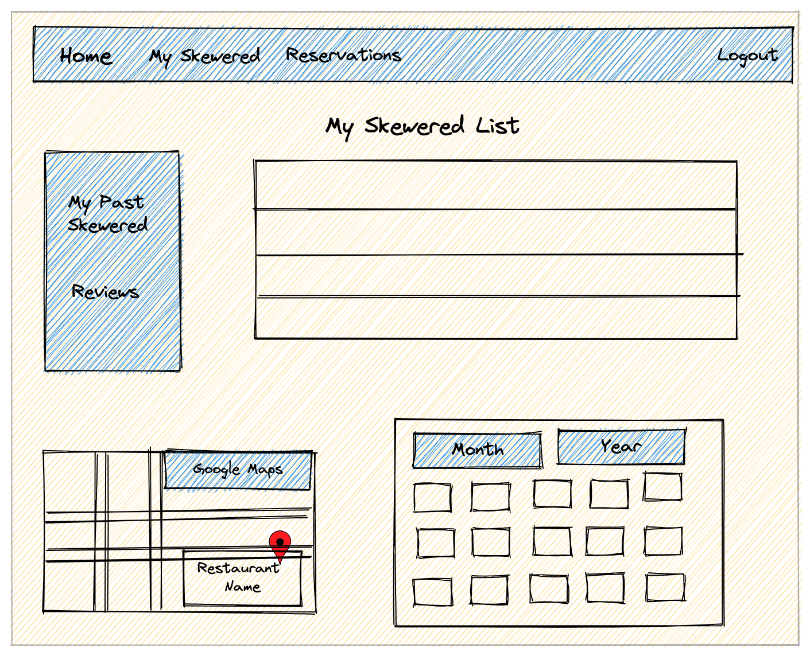

## Foodie - MySkewered History
- Page visibility: Foodies
- Description:
    - (NOT IN DRAWING:) Top/right area of the page will show a search bar to filter the skewered restaurants list by either cuisine, location, or reservation date/range (in case Foodie wants to find a restaurant they've been to in the past)
    - Middle left pane is an extension of the NavBar, inside the "My Skewered" page.
    - Middle right pane is the list of all the restaurants this Foodie has skewered AND visited.
    - Bottom pane shows a map view with pins to the past skewered (and visited) restaurants within an x-mile radius from either Foodie's current location. Foodie can drag map or enter a zip code (NOT IN DRAWING - there will be an input field right above the map where the Foodie can enter a city/zip), and map will update dynamically also showing the pins in that region shown in map.

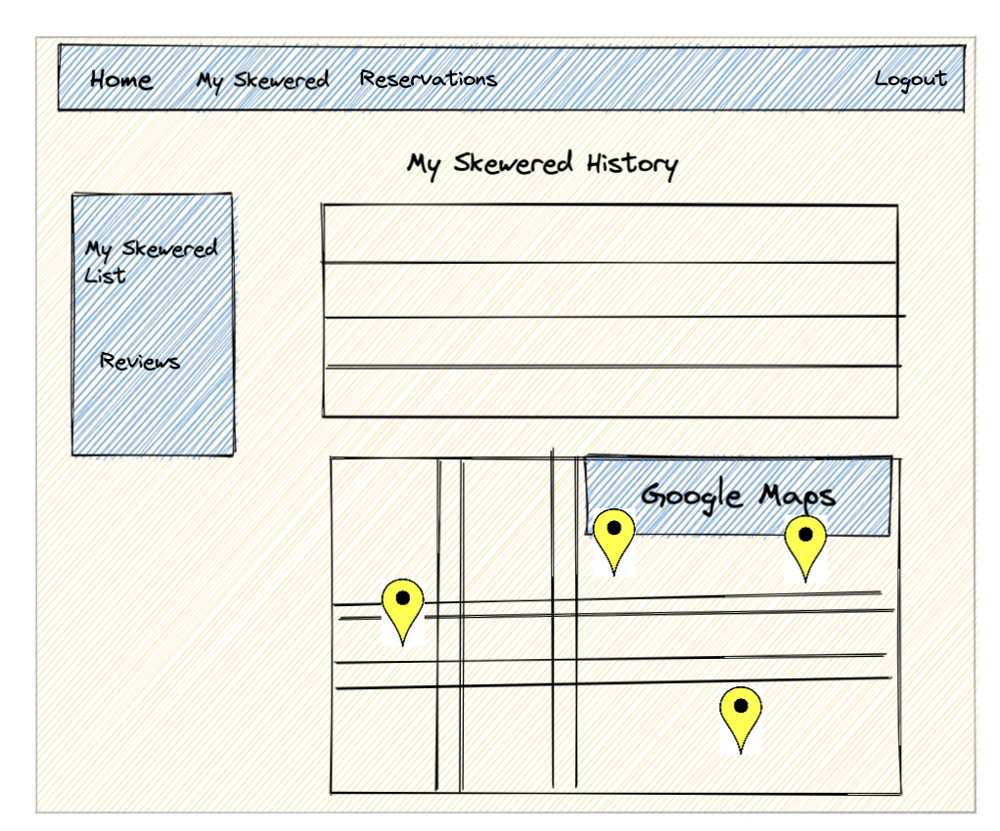

## Foodie - Reviews Dashboard: View review
- Page visibility: Foodies
- Description:
    - Left pane is an extension of the nav bar
    - Middle pane is a list of restaurants in the "MySkewered History" (which means, skewered AND visited)
        - Some of the restaurants, the Foodie has already left a review for
        - Some of the restaurants, the Foodie has yet to leave a review for
    - When a user selects a restaurant that the Foodie has already left a review for, the right pane shows the review this Foodie has left in the past (NOT IN DRAWING: may add an "update review" button -- TBD)

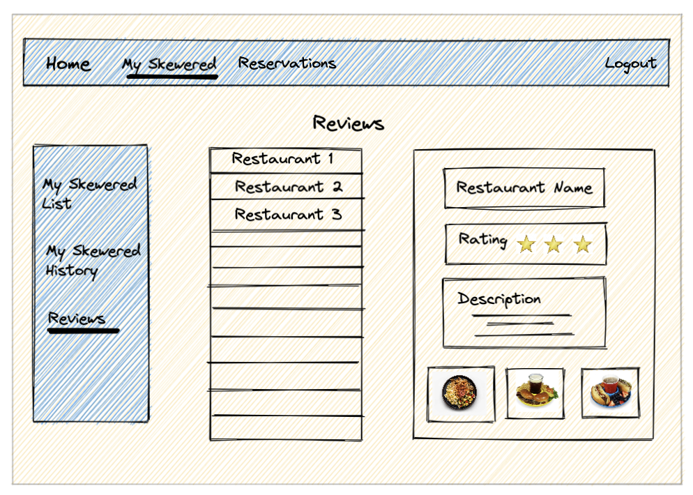

## Foodie - Reviews Dashboard: Create a review
- Page visibility: Foodies
- Description:
    - (Same as previous drawing) Left pane is an extension of the nav bar
    - (Same as previous drawing) Middle pane is a list of restaurants in the "MySkewered History" (which means, skewered AND visited)
        - Some of the restaurants, the Foodie has already left a review for
        - Some of the restaurants, the Foodie has yet to leave a review for
    - When a user selects a restaurant that the Foodie has yet to leave a review for, the right pane shows a form to create a review.

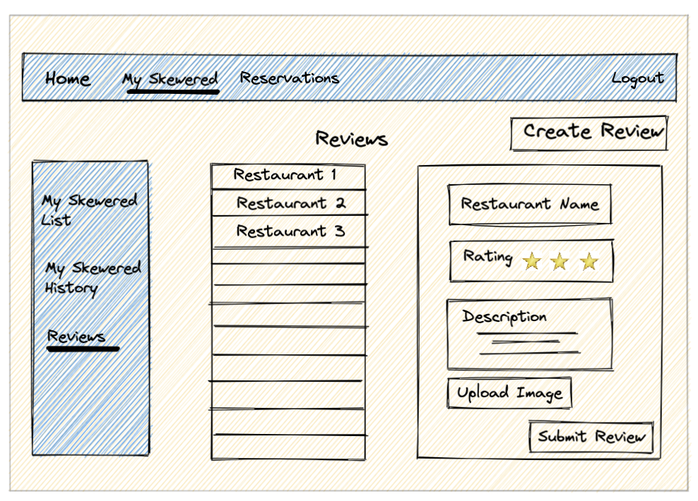

## Foodie - Reservations Dashboard
- Page visibility: Foodies
- Description:
    - Top left pane shows a calendar view indicating which dates have a reservation
    - Bottom left pane shows a list of reservations (NOT IN DRAWING: has scroll bar)
    - When a Foodie selects a reservation from the list of reservations
        - A right pane will open up with the details of a reservation (more details than pictured to be included)

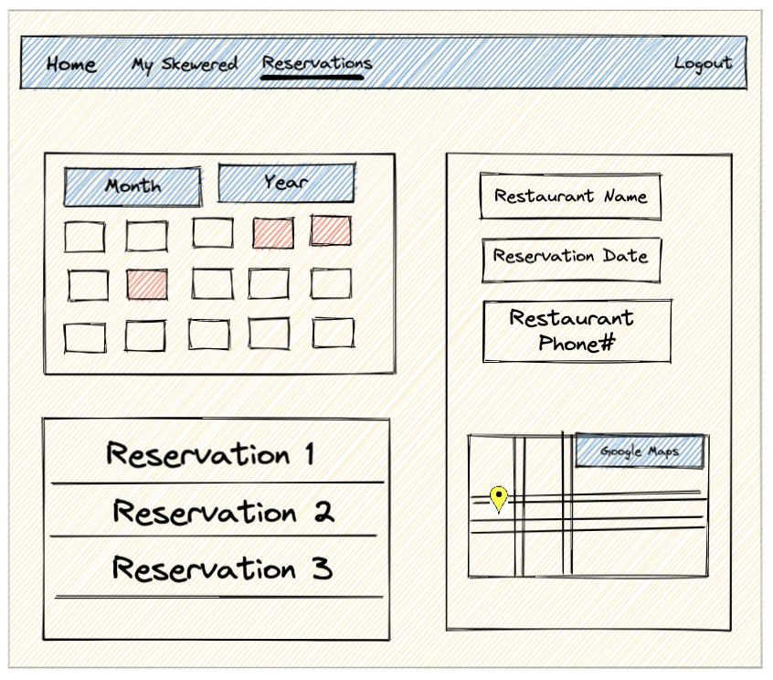

## Restaurant Owner - Promotion slot sign up/payment page
- Page visibility: Restaurant Owners
- Description: This is the page where a restaurant owner can sign up and pay for time slots to promote restaurant (this means that for the time slot the owner paid for, the specific restaurant will show up at the top on the "Restaurants List/Search" page)
    - Currently in bottom left pane in drawing (but will be moved to top left pane) shows a list of restaurants that this restaurant owner owns. The restaurant owner can select a restaurant (if more than one) and the calendar will update with the location-specific availability.
    - Currently in top left pane in drawing (but will be relocated to bottom left pane) shows a calendar view of time slots (unavailable/available) for promotions that the restaurant owner can sign up and pay for, for a specific restaurant. Time slot availability is specific to location (zip/city/region -- location delimiting TBD) since the "Restaurants List/Search" page is also location-specific.
    - (NOT IN DRAWING:) top right pane will show the datails of the time slot the restaurant owner wants to sign up and pay for:
        - Restaurant name (auto populated since Owner will have already selected restaurant in top-left pane),
        - Select available time slot/s (intervals of 1 hour, owner should be able to select multiple non-continuous slots at once. ex: 3-5pm on May 3rd, 6-8pm on May 4th, etc)
        - option to select recurring time slot??? (TBD) (owner would have to pay upfront at time of securing time slots even if recurring time slots are far in the future)
    - Currently in entire right pane (but will be relocated to bottom right pane) shows the form to enter payment information.

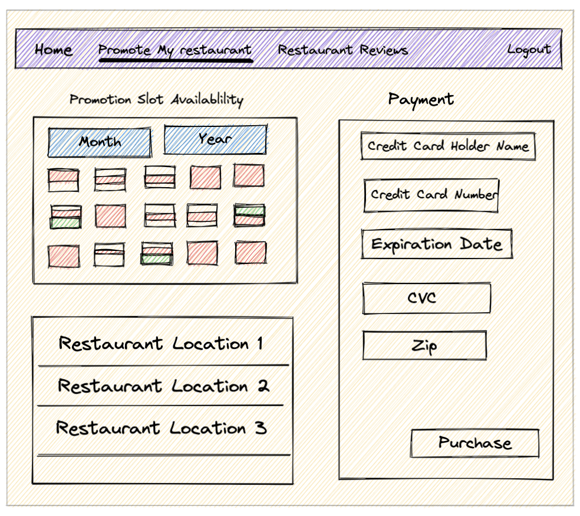

## Restaurant Owner - Promotion Schedule Dashboard - Default view shows all locations
- Page visibility: Restaurant Owners
- Description: This page provides a dashboard view of the promotion slots the restaurant owner has signed up and paid for.
    - Default view (when no specific restaurant on left pane is selected): Right pane shows a calendar view of all purchased promotion slots for all restaurants owned by this owner. The slots from different restaurants are differentiated by color (example: location 1 shows as blue in calendar, location 2 shows as green, location 3 shows as purple, etc)

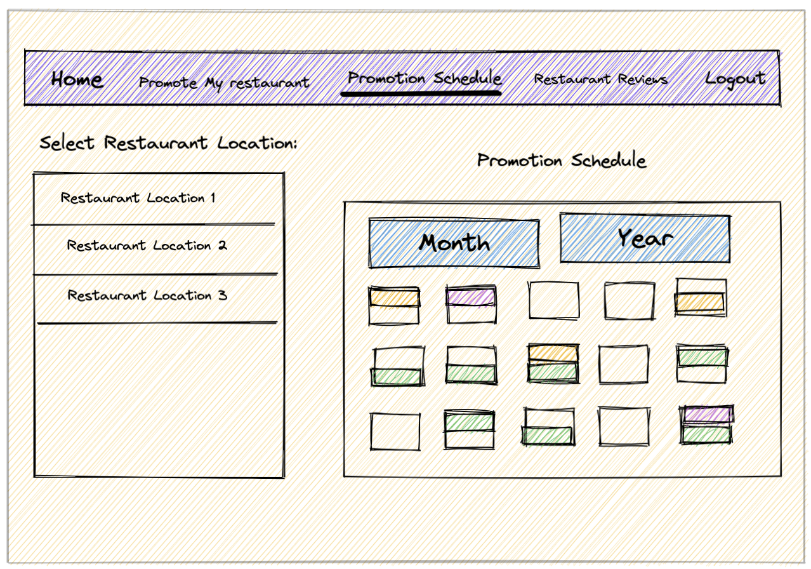

## Restaurant Owner - Promotion Schedule Dashboard - Restaurant-specific view
- Page visibility: Restaurant Owners
- Description: This page provides a dashboard view of the promotion slots the restaurant owner has signed up and paid for.
    - When a specific restaurant on left pane is selected: Right pane shows a calendar view of all purchased promotion slots for one specific restaurant owned by this owner.

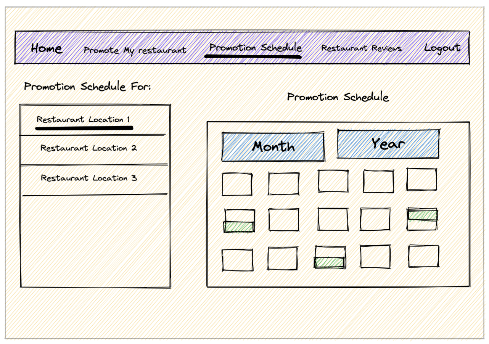

## Restaurant Owner - Reviews Dashboard
- Page visibility: Restaurant Owners
- Description: This page is a dashboard for reviews for restaurants this restaurant owner owns.
    - Left pane shows a list of the restaurants this restaurant owner owns (NOT IN DRAWING: scroll bar, if applicable).
    - Middle pane shows a list of all the reviews of the 1 restaurant selected on the left pane (NOT IN DRAWING: scroll bar, if applicable).
    - Right pane shows the details of the 1 review selected on the middle pane (NOT IN DRAWING: scroll bar, if applicable).

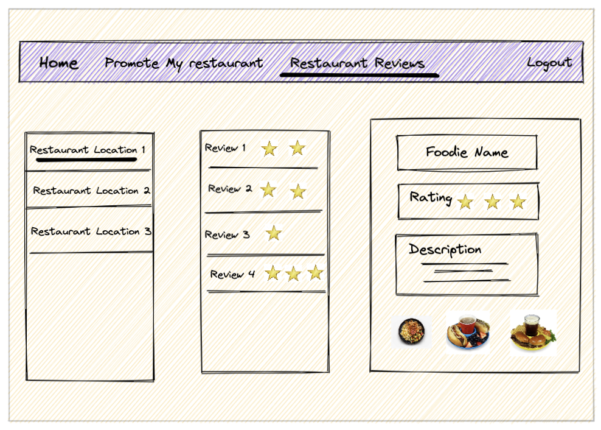

## Restaurant Owner - Reservations Dashboard
- Page visibility: Restaurant Owners
- Description: This page is a dashboard for reviews
    - Left pane shows a list of all the locations this restaurant owner owns.
    - Middle top pane shows a calendar view of all the reservations for the location selected in left pane. (Some dropdown/toggle available in app so owner can change the calendar view to show either DAY view, 3 DAYS view, WEEK view or MONTH view -- all options available)
    - Middle bottom pane will show a list view of all the reservations for the location selected in left pane. (CURRENTLY INCORRECTLY SHOWN IN DRAWING - each list item in this section should be "Reservation on *Date*, *Time*, by *FoodieName*)" instead of the currently shown "Restaurant Location 1")
    - Right pane shows the details for a single reservation when selected from either the middle top pane (calendar view) or middle bottom pane (list view).

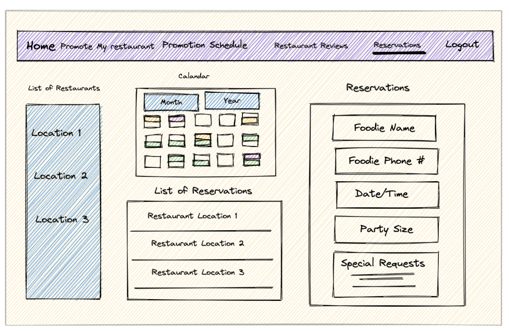